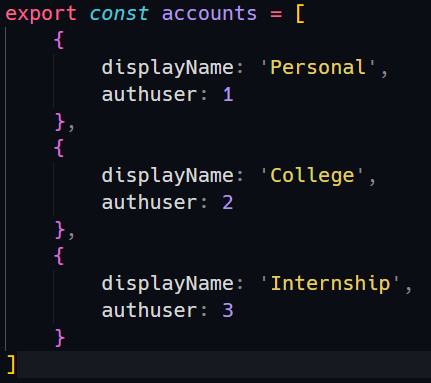

# Google Meet Account Switcher - Chrome Extension <!-- omit in toc -->

Quickly switch between multiple accounts in Google Meet.  
"Why can't I just use the 'Switch Account' feature in Meet?", I hear you ask. When you use that, you are redirected to a new page where you select another account and then you are redirected back. On the other hand when you use this extension, you just need 2 clicks and it's done.

## Contents: <!-- omit in toc -->

- [Setup](#setup)
- [Installation](#installation)
- [Demo](#demo)
- [Feedback](#feedback)

## Setup

1. Download the zip from [here](https://github.com/arindamlahiri/google-meet-account-switcher/raw/main/google-meet-account-switcher.zip) and extract it
2. All the account details are in `accounts.js`. You can edit the details in this file. There are two fields for each account.
3. `displayName` : This is the name by which your account will show up in the extension.
4. `authuser`: In most google apps, google uses a system of numbering our accounts. `0` being the number for the default account in chrome, then `1`,`2` and so on for each account added. For the accounts you want to switch between, you need to know this number. To find out, just go to [https://meet.google.com](https://meet.google.com) . In the top right, whichever account shows up that is your default account (numbered `0`). Then click on your display picture and switch to another account. Now in the address bar you would have something like `?authuser=x`. x is the number we need.
5. Repeat step 4 for all the accounts you want to switch between. You can add or remove accounts in `accounts.js` as per your need. Make sure to follow the same format.

Here's how my `accounts.js` file looks like(Note: I don't use my default account for google meet, hence no `authuser:0` for me) :  

## Installation

1. In chrome, go to `chrome://extensions/`
2. [Top right] Turn on developer mode
3. [Top left] Click on `Load unpacked` and choose the extracted folder. The extension is now installed
4. Go to any google meet link and use the extension
5. You can also pin the extension so that it always stays in the extensions tray

## Demo

## Feedback

If you have any feedback, good or bad, feel free to reach out to me on [Twitter](https://twitter.com/arindamcodes) 😃
